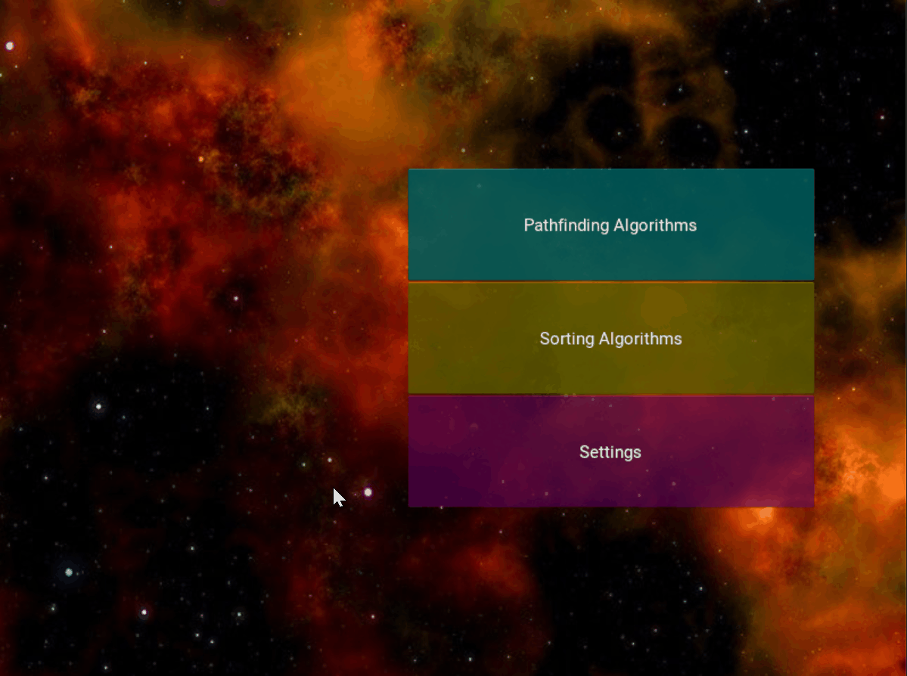

# Kivy_Pathfinding_Sorting_Visualization

Pathfinding and sorting algorithms visualization with a scalable user interface built with Kivy.
Users can choose the start, end, and barrier nodes. Users can go through the algorithm step by step or let it run on auto. Users can change any of the colors.  
This is a project that I worked on by myself to better understand Kivy and the pathfinding and sorting algorithms.

## Running and requirements

The only requirement is kivy version 2.0.0
Run `main.py` to run the application
All file imports are in `main.py`, `pathfindingAlgo_layout.py`, `sortAlgo_layout.py`, and `algovizkivy.kv`

## Features

- You can pick start and end node for pathfinding algorithms anywhere in the grid
- You can draw the barrier for pathfinding algorithms
- You can choose the length of the rows/arrays in the sorting algorithms
- After you run the algorithm you can go through it step by step or have it run on auto and you can control the speed
- You can change rows and columns to any number between 4 and 400
- You can change all the colors in the grid in the settings page
- For pathfinding you can choose any algorithm or generate a random maze
- For sorting you can choose any algorithm or generate a random length row
- You can reset the algorithm and grid anytime
- The grid and user interface are scalable

I have implemented this algorithms so far:

- A-star pathfinding algorithm
- Dijkstra algorithm
- Breadth first search algorithm
- Bubble sort algorithm
- Insertion sort algorithm
- Selection sort algorithm

### Pathfinding

- Click anywhere to draw the start and end nodes. Click and drag to draw the barrier. Click any node to make it an empty node again.
- Pick one of the algorithms and click run. Either press next or enable auto to move forward with the search. The Speed slider controls the speed the algorithm searches at.
- Click reset to reset the grid and algorithm
- Click row or column after entering a number between 4-400 to redraw the grid with those number
- You can change the start, end, or barrier node and run again. You can change the algorithms and run again.

### Sorting

- Click and drag to draw the length of the rows(Farthest right will be taken)
- Click once to draw the length of the rows(Farthest right empty node will be taken, this has priority over click and drag)
- After choosing random, pressed reset to randomize the length
- Everything else is the same as Pathfinding

### Contributions

If you have any ideas or contributions, feel free to create a pull request.

